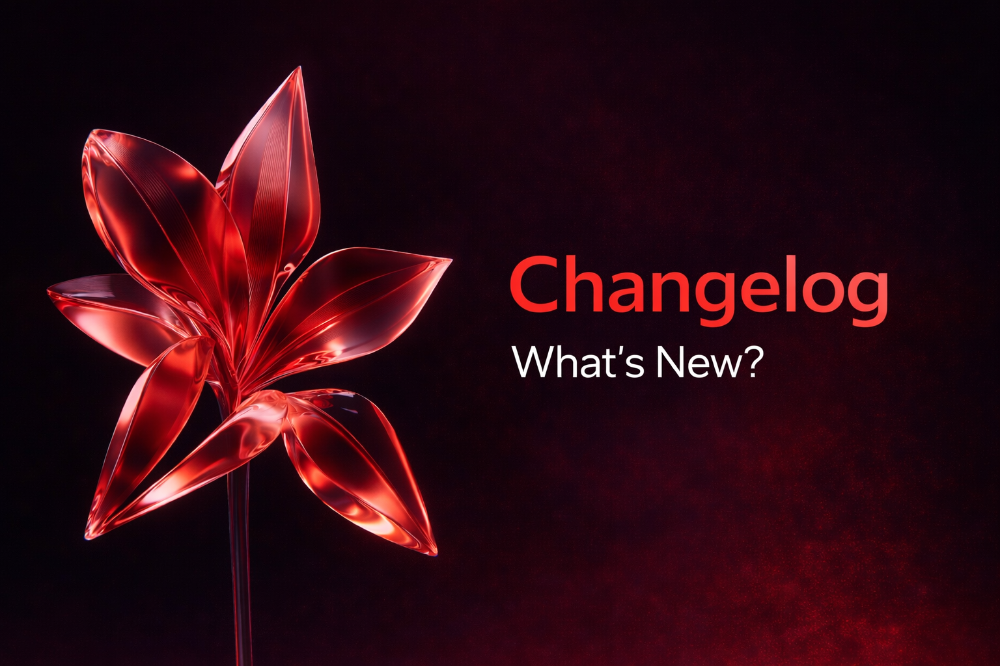

# Astra Client 🌌


**Astra Client** — это современный, красивый и функциональный лаунчер для Minecraft, построенный на веб-технологиях. Он сочетает в себе минималистичный дизайн с мощными возможностями управления игрой.



## ✨ Возможности

### 🎮 Управление Игрой
- **Мульти-версионность**: Установка и запуск любых версий Minecraft (Release, Snapshot).
- **Авто-установка Fabric**: Лаунчер автоматически скачивает и устанавливает Fabric Loader, если он требуется.
- **Умный запуск**: Автоматическое определение установленных версий Java (включая Java 21 для новых версий игры).
- **Изоляция**: Каждая версия имеет свою изолированную папку для модов, конфигов и сохранений.

### 🛠 Кастомизация и Моды
- **Менеджер Контента**: Просмотр и управление установленными модами, ресурспаками и мирами прямо из лаунчера.
- **Интеграция Modrinth** (В разработке): Поиск и установка модов напрямую из интерфейса.
- **Темы Оформления**:
  - Встроенные темы (Dark, Light, Minecraft Green, Nether Red и др.).
  - **Редактор тем**: Настройка акцентного цвета.
  - **Импорт/Экспорт**: Возможность делиться своими темами (JSON).

### 🔐 Аккаунты
- **Microsoft Auth**: Полноценная поддержка лицензионных аккаунтов.
- **Offline Mode**: Возможность играть без лицензии (с произвольным никнеймом).
- **Мультиаккаунт**: Быстрое переключение между профилями.

### ⚙️ Продвинутые Настройки
- Настройка выделения оперативной памяти (RAM) с визуальным слайдером.
- Выбор разрешения окна и полноэкранный режим.
- Аргументы JVM.
- Управление поведением лаунчера после запуска игры.

## 🛠 Технологический Стек

Проект построен на современном стеке технологий (Electron + Vite + React):

- **Core**: [Electron](https://www.electronjs.org/)
- **Frontend**: [React](https://reactjs.org/), [TypeScript](https://www.typescriptlang.org/)
- **Build Tool**: [Vite](https://vitejs.dev/)
- **Styling**: [Tailwind CSS](https://tailwindcss.com/)
- **State Management**: [Zustand](https://github.com/pmndrs/zustand)
- **UI Components**: [Lucide React](https://lucide.dev/), [Framer Motion](https://www.framer.com/motion/)
- **Minecraft Core**: [minecraft-launcher-core](https://github.com/Pierce01/MinecraftLauncher-core)
- **Auth**: [MSMC](https://github.com/Hanro50/msmc)

## 🚀 Установка и Запуск (Для Разработчиков)

### Предварительные требования
- **Node.js**: Версия 18 или выше.
- **Java**: Рекомендуется установить JDK 17 и JDK 21 для поддержки всех версий Minecraft.

### Шаги установки

1. **Клонируйте репозиторий:**
   ```bash
   git clone https://github.com/your-username/astra-client.git
   cd astra-client
   ```

2. **Установите зависимости:**
   ```bash
   npm install
   ```

3. **Запустите в режиме разработки:**
   ```bash
   npm run electron:dev
   ```
   Эта команда запустит Vite сервер и окно Electron с горячей перезагрузкой (HMR).

### Сборка проекта

Для создания установочного файла (`.exe` для Windows):

1. **Подготовьте ресурсы (Опционально):**
   Поместите `icon.ico` в папку `build/` для иконки установщика.

2. **Запустите сборку:**
   ```bash
   npm run electron:build
   ```

3. Готовый установщик будет находиться в папке `release/`.

## 📂 Структура Проекта

```
astra-client/
├── electron/           # Исходный код Main процесса Electron
│   ├── main.ts         # Точка входа, IPC хендлеры, запуск игры
│   └── preload.ts      # Мост между Electron и React
├── src/                # Исходный код Frontend (React)
│   ├── components/     # UI компоненты (Button, Layout, etc.)
│   ├── pages/          # Страницы (Home, Settings, Content, etc.)
│   ├── store/          # Глобальный стейт (Zustand)
│   ├── types/          # TypeScript интерфейсы
│   └── lib/            # Утилиты
├── public/             # Статические ресурсы (картинки)
├── build/              # Ресурсы для сборщика (иконки установщика)
└── release/            # Папка с готовыми билдами
```

## 🤝 Вклад в проект (Contributing)

Мы приветствуем любой вклад! Если вы нашли ошибку или хотите предложить новую функцию:

1. Создайте Issue с описанием проблемы.
2. Сделайте Fork репозитория.
3. Создайте ветку для ваших изменений (`git checkout -b feature/AmazingFeature`).
4. Закоммитьте изменения (`git commit -m 'Add some AmazingFeature'`).
5. Запушьте ветку (`git push origin feature/AmazingFeature`).
6. Откройте Pull Request.

## 📄 Лицензия

Распространяется под лицензией MIT. Подробнее см. в файле [LICENSE](LICENSE).

---
*Created with ❤️ by Astra Team*
