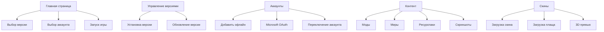

## 1. Обзор продукта

Современный desktop-лаунчер Minecraft с элегантным интерфейсом, объединяющий управление версиями, аккаунтами и контентом в одном приложении. Предназначен для упрощения запуска Minecraft и управления игровым контентом.

**Целевая аудитория:** Игроки Minecraft, желающие удобный способ управления версиями, модами и аккаунтами.

## 2. Основные функции

### 2.1 Пользовательские роли

| Роль | Способ регистрации | Основные разрешения |
|------|-------------------|-------------------|
| Офлайн пользователь | Локальное создание | Запуск игры, управление контентом |
| Пользователь Microsoft | OAuth авторизация | Полный доступ, синхронизация скинов |

### 2.2 Модули функциональности

Основные страницы лаунчера:

1. **Главная страница**: Выбор версии, запуск игры, быстрые действия
2. **Управление версиями**: Список версий, установка, обновления
3. **Аккаунты**: Добавление, переключение, управление профилями
4. **Контент**: Моды, миры, ресурспаки, скриншоты
5. **Скины**: Загрузка, предпросмотр, применение скинов и плащей
6. **Настройки**: Темы, пути установки, параметры запуска

### 2.3 Детали страниц

| Страница | Модуль | Описание функции |
|----------|---------|------------------|
| Главная | Селектор версии | Отображение списка установленных версий с иконками типа (релиз/снапшот/бета) |
| Главная | Кнопка Play | Крупная выделенная кнопка запуска с индикатором загрузки |
| Главная | Быстрые действия | Ярлыки к последним мирам, избранным модам и аккаунтам |
| Версии | Список версий | Таблица со всеми доступными версиями Minecraft с фильтрацией |
| Версии | Установка | Кнопка установки с прогресс-баром и процентом загрузки |
| Версии | Информация о версии | Отображение даты релиза, типа версии, размера |
| Аккаунты | Список аккаунтов | Карточки с аватарками, именами и типами аккаунтов |
| Аккаунты | Добавить аккаунт | Кнопки для офлайн и Microsoft авторизации |
| Аккаунты | Профиль | Отображение скина, UUID, статуса аккаунта |
| Контент | Моды | Список модов с переключателями вкл/выкл, кнопки установки/удаления |
| Контент | Миры | Превью миров, информация о версии, кнопки импорта/экспорта |
| Контент | Скриншоты | Галерея с превью, датой создания, кнопками удаления/экспорта |
| Контент | Ресурспаки | Список с превью, переключение активности, удаление |
| Скины | Загрузка скина | Drag-and-drop область, поддержка форматов PNG, превью 3D модели |
| Скины | Загрузка плаща | Аналогично скину, но для плащей |
| Скины | Применение | Кнопка сохранения изменений, отмена |
| Настройки | Темы | Выбор из предустановленных тем и кастомный цвет акцента |
| Настройки | Пути | Настройка директорий установки Minecraft и контента |
| Настройки | Параметры запуска | JVM аргументы, выделение памяти, дополнительные флаги |

## 3. Основные процессы

### Процесс запуска игры:
1. Пользователь выбирает версию Minecraft из списка
2. Выбирает аккаунт для входа
3. Нажимает кнопку "Play"
4. Лаунчер проверяет установленные файлы версии
5. При необходимости загружает недостающие файлы с индикацией прогресса
6. Запускает Minecraft с выбранным аккаунтом

### Процесс установки мода:
1. Пользователь переходит в раздел "Контент" → "Моды"
2. Нажимает кнопку "Добавить мод" или перетаскивает JAR файл
3. Система проверяет совместимость мода с текущей версией
4. Мод добавляется в список с автоматическим включением
5. Отображается уведомление об успешной установке

### Процесс смены скина:
1. Пользователь переходит в раздел "Скины"
2. Загружает PNG файл скина через drag-and-drop или кнопку
3. Видит 3D превью скина на модели игрока
4. Нажимает "Применить" для сохранения
5. Скин загружается и применяется к аккаунту

## 4. Пользовательский интерфейс

### 4.1 Стиль дизайна

**Цветовая палитра:**
- Основной фон: `#0A0A0B` (черный с легким оттенком)
- Вторичный фон: `#1C1C1E` (темно-серый)
- Акцентный цвет: `#10B981` (изумрудный, настраиваемый)
- Текст: `#F9FAFB` (светло-серый)
- Вторичный текст: `#9CA3AF` (серый)

**Компоненты:**
- Скругления: `rounded-lg` и выше (12px+)
- Glassmorphism: `backdrop-blur-lg bg-white/10` для окон и карточек
- Тени: `shadow-2xl` для выделенных элементов
- Анимации: 300-500ms transitions, micro-interactions на hover/click

**Типографика:**
- Основной шрифт: Inter, системные sans-serif
- Заголовки: 24-32px, полужирные
- Основной текст: 14-16px
- Мелкий текст: 12-14px

### 4.2 Детали страниц

| Страница | Модуль | UI элементы |
|----------|---------|-------------|
| Главная | Селектор версии | Выпадающий список с иконками типа версии, glass-эффект |
| Главная | Кнопка Play | Крупная кнопка 200x60px, градиентный фон, hover-эффект с масштабированием |
| Главная | Быстрые действия | Горизонтальный скролл карточек 120x160px с превью и тенями |
| Версии | Таблица версий | Data table с striped rows, sortable columns, search bar сверху |
| Версии | Прогресс загрузки | Linear progress bar с процентами, анимированный индикатор |
| Аккаунты | Карточки аккаунтов | Grid layout 2x2, аватарки 80x80px, glass-карточки с hover-эффектами |
| Аккаунты | Кнопки действий | Rounded buttons с иконками, primary/secondary стили |
| Контент | Список модов | Virtualized list с чекбоксами, drag-and-drop зона сверху |
| Контент | Превью миров | Thumbnail grid 160x90px, hover overlay с действиями |
| Скины | 3D превью | Интерактивная 3D модель игрока, orbit controls, lighting |
| Скины | Загрузка | Drag-and-drop область 300x400px, dashed border, hover states |

### 4.3 Адаптивность

**Desktop-first подход** с адаптацией под:
- Основной размер: 1280x720px и выше
- Минимальный размер: 1024x640px
- Touch-оптимизация для планшетов
- Сохранение функциональности на всех размерах

### 4.4 Анимации и эффекты

**Page transitions:**
- Fade-in при загрузке страниц (400ms)
- Slide-in для модальных окон (300ms)
- Staggered animations для списков

**Micro-interactions:**
- Hover: scale(1.02), shadow усиление
- Click: scale(0.98), ripple эффект
- Loading: skeleton screens с пульсацией
- Success: checkmark animation с bounce

**Glassmorphism:**
- Backdrop blur (20px) для окон и диалогов
- Прозрачность 10-20% для фона
- Border glow эффект для активных элементов