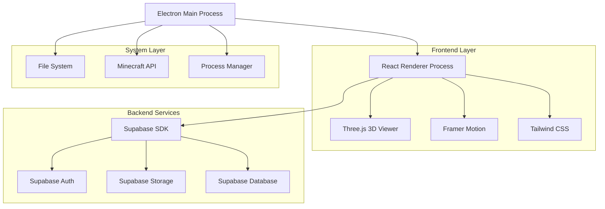
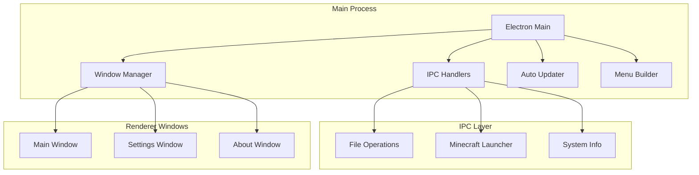
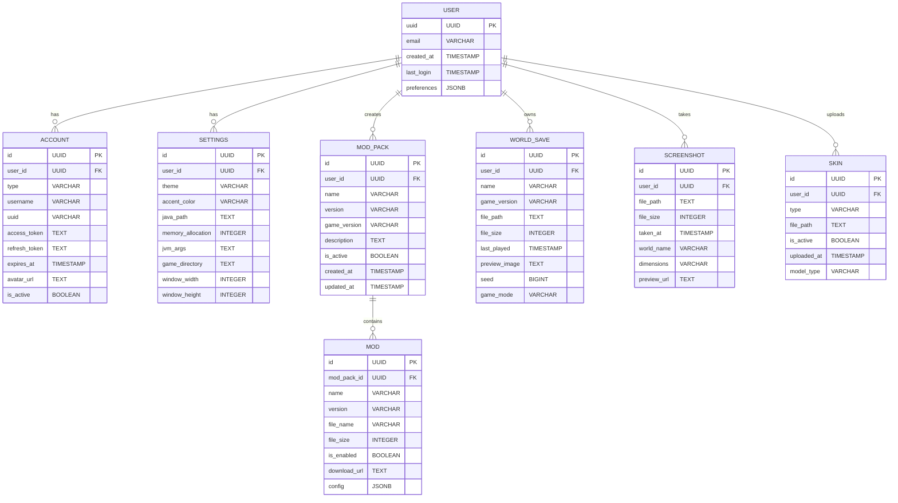
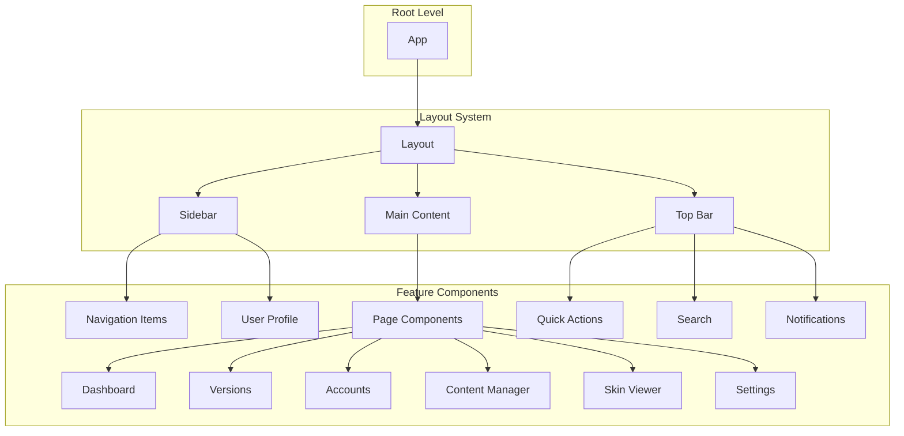

## 1. Архитектура проекта



## 2. Технологический стек

- **Frontend:** React@18 + TypeScript + Vite
- **Desktop Framework:** Electron@27
- **Стилизация:** Tailwind CSS@3 + PostCSS
- **Анимации:** Framer Motion@10
- **3D рендеринг:** Three.js@0.158 + @react-three/fiber@8
- **Иконки:** lucide-react@0.294
- **Управление состоянием:** Zustand@4
- **Backend:** Supabase (Authentication, Storage, Database)
- **Инициализация:** electron-vite

## 3. Определение маршрутов

| Маршрут | Назначение |
|---------|------------|
| / | Главная страница с выбором версии и запуском |
| /versions | Управление версиями Minecraft |
| /accounts | Управление аккаунтами |
| /content/mods | Менеджер модов |
| /content/worlds | Менеджер миров |
| /content/resource-packs | Менеджер ресурспаков |
| /content/screenshots | Галерея скриншотов |
| /skins | 3D редактор скинов и плащей |
| /settings | Настройки лаунчера |

## 4. API определения

### 4.1 Minecraft API Integration

**Получение списка версий:**
```
GET https://launchermeta.mojang.com/mc/game/version_manifest.json
```

**Загрузка клиента:**
```
GET https://launcher.mojang.com/v1/objects/{client_hash}/client.jar
```

**Загрузка библиотек:**
```
GET https://libraries.minecraft.net/{library_path}
```

### 4.2 Authentication API

**Microsoft OAuth:**
```
POST /api/auth/microsoft
```

Request:
```typescript
interface MicrosoftAuthRequest {
  code: string;
  redirect_uri: string;
}
```

Response:
```typescript
interface AuthResponse {
  access_token: string;
  refresh_token: string;
  expires_in: number;
  user: {
    id: string;
    username: string;
    email?: string;
    avatar_url?: string;
  };
}
```

**Offline Auth:**
```
POST /api/auth/offline
```

Request:
```typescript
interface OfflineAuthRequest {
  username: string;
  uuid?: string;
}
```

## 5. Архитектура Electron приложения



## 6. Модель данных

### 6.1 Схема базы данных



### 6.2 DDL для Supabase

```sql
-- Таблица пользователей
CREATE TABLE users (
    id UUID PRIMARY KEY DEFAULT gen_random_uuid(),
    email VARCHAR(255) UNIQUE,
    created_at TIMESTAMP WITH TIME ZONE DEFAULT NOW(),
    last_login TIMESTAMP WITH TIME ZONE DEFAULT NOW(),
    preferences JSONB DEFAULT '{}'::jsonb
);

-- Таблица аккаунтов
CREATE TABLE accounts (
    id UUID PRIMARY KEY DEFAULT gen_random_uuid(),
    user_id UUID REFERENCES users(id) ON DELETE CASCADE,
    type VARCHAR(20) NOT NULL CHECK (type IN ('offline', 'microsoft')),
    username VARCHAR(50) NOT NULL,
    uuid VARCHAR(36) UNIQUE,
    access_token TEXT,
    refresh_token TEXT,
    expires_at TIMESTAMP,
    avatar_url TEXT,
    is_active BOOLEAN DEFAULT false,
    created_at TIMESTAMP WITH TIME ZONE DEFAULT NOW(),
    updated_at TIMESTAMP WITH TIME ZONE DEFAULT NOW()
);

-- Таблица настроек
CREATE TABLE settings (
    id UUID PRIMARY KEY DEFAULT gen_random_uuid(),
    user_id UUID REFERENCES users(id) ON DELETE CASCADE,
    theme VARCHAR(20) DEFAULT 'dark',
    accent_color VARCHAR(7) DEFAULT '#10B981',
    java_path TEXT,
    memory_allocation INTEGER DEFAULT 2048,
    jvm_args TEXT DEFAULT '-Xmx2G -XX:+UseG1GC',
    game_directory TEXT,
    window_width INTEGER DEFAULT 1280,
    window_height INTEGER DEFAULT 720,
    created_at TIMESTAMP WITH TIME ZONE DEFAULT NOW(),
    updated_at TIMESTAMP WITH TIME ZONE DEFAULT NOW()
);

-- Таблица мод-паков
CREATE TABLE mod_packs (
    id UUID PRIMARY KEY DEFAULT gen_random_uuid(),
    user_id UUID REFERENCES users(id) ON DELETE CASCADE,
    name VARCHAR(100) NOT NULL,
    version VARCHAR(20) NOT NULL,
    game_version VARCHAR(20) NOT NULL,
    description TEXT,
    is_active BOOLEAN DEFAULT false,
    created_at TIMESTAMP WITH TIME ZONE DEFAULT NOW(),
    updated_at TIMESTAMP WITH TIME ZONE DEFAULT NOW()
);

-- Таблица модов
CREATE TABLE mods (
    id UUID PRIMARY KEY DEFAULT gen_random_uuid(),
    mod_pack_id UUID REFERENCES mod_packs(id) ON DELETE CASCADE,
    name VARCHAR(100) NOT NULL,
    version VARCHAR(20) NOT NULL,
    file_name VARCHAR(255) NOT NULL,
    file_size INTEGER,
    is_enabled BOOLEAN DEFAULT true,
    download_url TEXT,
    config JSONB DEFAULT '{}'::jsonb,
    created_at TIMESTAMP WITH TIME ZONE DEFAULT NOW()
);

-- Таблица миров
CREATE TABLE world_saves (
    id UUID PRIMARY KEY DEFAULT gen_random_uuid(),
    user_id UUID REFERENCES users(id) ON DELETE CASCADE,
    name VARCHAR(100) NOT NULL,
    game_version VARCHAR(20),
    file_path TEXT NOT NULL,
    file_size INTEGER,
    last_played TIMESTAMP,
    preview_image TEXT,
    seed BIGINT,
    game_mode VARCHAR(20),
    created_at TIMESTAMP WITH TIME ZONE DEFAULT NOW()
);

-- Таблица скриншотов
CREATE TABLE screenshots (
    id UUID PRIMARY KEY DEFAULT gen_random_uuid(),
    user_id UUID REFERENCES users(id) ON DELETE CASCADE,
    file_path TEXT NOT NULL,
    file_size INTEGER,
    taken_at TIMESTAMP WITH TIME ZONE DEFAULT NOW(),
    world_name VARCHAR(100),
    dimensions VARCHAR(50),
    preview_url TEXT
);

-- Таблица скинов
CREATE TABLE skins (
    id UUID PRIMARY KEY DEFAULT gen_random_uuid(),
    user_id UUID REFERENCES users(id) ON DELETE CASCADE,
    type VARCHAR(20) NOT NULL CHECK (type IN ('skin', 'cape')),
    file_path TEXT NOT NULL,
    is_active BOOLEAN DEFAULT false,
    uploaded_at TIMESTAMP WITH TIME ZONE DEFAULT NOW(),
    model_type VARCHAR(20) DEFAULT 'classic'
);

-- Индексы для производительности
CREATE INDEX idx_accounts_user_id ON accounts(user_id);
CREATE INDEX idx_accounts_is_active ON accounts(is_active);
CREATE INDEX idx_settings_user_id ON settings(user_id);
CREATE INDEX idx_mod_packs_user_id ON mod_packs(user_id);
CREATE INDEX idx_mods_mod_pack_id ON mods(mod_pack_id);
CREATE INDEX idx_world_saves_user_id ON world_saves(user_id);
CREATE INDEX idx_screenshots_user_id ON screenshots(user_id);
CREATE INDEX idx_skins_user_id ON skins(user_id);

-- Политики безопасности Supabase
-- Доступ для анонимных пользователей (чтение публичных данных)
GRANT SELECT ON users TO anon;
GRANT SELECT ON accounts TO anon;

-- Полный доступ для аутентифицированных пользователей
GRANT ALL PRIVILEGES ON users TO authenticated;
GRANT ALL PRIVILEGES ON accounts TO authenticated;
GRANT ALL PRIVILEGES ON settings TO authenticated;
GRANT ALL PRIVILEGES ON mod_packs TO authenticated;
GRANT ALL PRIVILEGES ON mods TO authenticated;
GRANT ALL PRIVILEGES ON world_saves TO authenticated;
GRANT ALL PRIVILEGES ON screenshots TO authenticated;
GRANT ALL PRIVILEGES ON skins TO authenticated;

-- RLS политики (Row Level Security)
ALTER TABLE users ENABLE ROW LEVEL SECURITY;
ALTER TABLE accounts ENABLE ROW LEVEL SECURITY;
ALTER TABLE settings ENABLE ROW LEVEL SECURITY;
ALTER TABLE mod_packs ENABLE ROW LEVEL SECURITY;
ALTER TABLE mods ENABLE ROW LEVEL SECURITY;
ALTER TABLE world_saves ENABLE ROW LEVEL SECURITY;
ALTER TABLE screenshots ENABLE ROW LEVEL SECURITY;
ALTER TABLE skins ENABLE ROW LEVEL SECURITY;

-- Пользователи могут видеть только свои данные
CREATE POLICY "Users can view own data" ON users
    FOR SELECT USING (auth.uid() = id);

CREATE POLICY "Users can update own data" ON users
    FOR UPDATE USING (auth.uid() = id);

CREATE POLICY "Users can view own accounts" ON accounts
    FOR SELECT USING (auth.uid() = user_id);

CREATE POLICY "Users can manage own accounts" ON accounts
    FOR ALL USING (auth.uid() = user_id);
```

## 7. Архитектура компонентов React



## 8. Система сборки и деплоймент

**Сборка:**
- electron-vite для сборки main и renderer процессов
- Автоматическое обновление через electron-updater
- Code signing для Windows и macOS

**Платформы:**
- Windows (x64, ARM64)
- macOS (x64, ARM64)
- Linux (x64, ARM64)

**Дистрибуция:**
- GitHub Releases для автоматических обновлений
- Самораспаковывающиеся установщики
- Portable версии для Windows